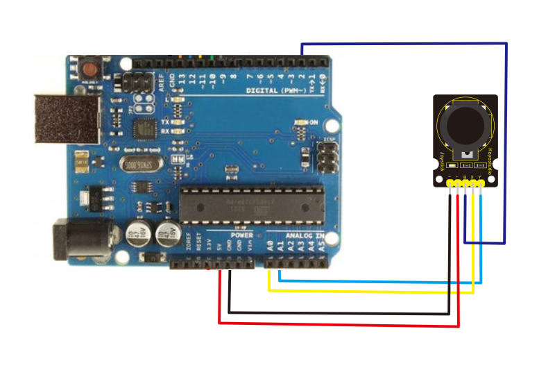

# ArduinoJoyInput

Allows mouse input via the [Ks0008 Joystick module from Keyes](https://wiki.keyestudio.com/Ks0008_keyestudio_Joystick_Module) using serial instead of HID, since Arduino Uno is being used for this project and it doesn't have support for it.

This code is for a school project so it may not be polished or may not work every time.

## Schematic

- ``+5V`` on ``5V``
- ``-`` on ``GND``
- ``X`` on ``A0``
- ``Y`` on ``A1``
- ``SW`` or ``B`` on digital 2

## Setup

Tested under Windows and Linux.

- Clone this repo or download source

- Allow serial usage on Linux if needed
- Upload the code under ``src/joystick`` to your Arduino.
- Once uploaded, install the Python dependencies at ``requirements.txt`` and run ``src/driver/driver.py`` for making the joystick work.

## Quirks

- Using ``230400`` baud for faster transfer rates, please lower the value in driver and Arduino code if serial driver cannot handle such rate.
- Change the sensibility under driver ``SENSI`` variable if needed. Default is ``480.0``.
- On Windows, change the serial port on driver code to ``COM3`` or ``COM4``. Try restarting your computer if it doesn't recognize the Arduino.
- On Linux, the Python driver only works under X11. Wayland is not supported.
- If using Wayland anyway, only legacy applications will support mouse clicking and movement will not work. ~~TODO: Wayland support??~~

## License

2025 Lucas Gabriel (lucmsilva). Licensed under the [BSD 3-Clause](LICENSE).
